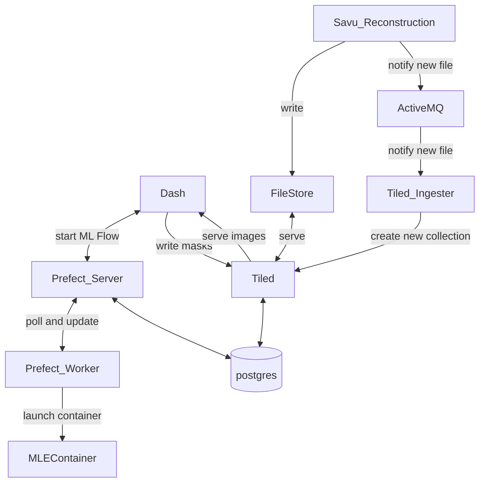

# mlex_tomo_framework
This repo creates a space for documentation and tracking of work needed to create an framework for running the MLExchange Segmentation framework at a beamline. It contains:
- Documentation, both user and configuration
- Sample `docker-compose.yml` file intended for the easy installation of the framework on developer's machines.

This repository is not intended to solve all of the real world deployment issues that one will find at a beamline. In a real beamline, not all of the various services will be on the same machine. However, it is very useful for developers to be able quickly stand up the full platform on a single machine. When the framework is installed at or near beamlines, the `docker-compose.yml` is a good guide towards deploying services on various container orchestration platforms (Hey, have you ever used `Kompose` is build k8s manifests from a docker-compose? It sorta works even!)

# The framework



## prefect server
RESTful service with a UI that controls and tracks workflows

## postgres
Database used by both tiled and prefect. Note that we are not installing postgres currently in this project. Both servers default to using sqlite, which is pretty great for this.

## Tiled
Data service where data is read/written from in web application.

## Tiled Ingester
Service that listens on ActiveMQ for new files. 

# podman notes
Podman can be a little trickier than docker, especially when run in rootless mode (the default) and on Mac. A few notes about how I produced a working environment:
- Install podman via brew (4.9.2)
- Create the virtual machine with
```
podman machine init --now --cpus=4 --memory=4096 -v $HOME:$HOME
```
- I recently tried to get it running with the `applehv` instead of `qemu`, and that didn't work.

## postgres
mkdir -p ./postgress/data

## Data folders
This repo comes with configuration for several folders under the `/data` directory

### prefect_db
Folder for the postegres server for Prefect to write files is inlucded in `.gitignore`

### tiled_db
Folder for the postegres server for Tiled to write files is inlucded in `.gitignore`

### tiled_storage
Folder where Tiled reads and writes data. It has two subdirectories:
- `recons` this folder contains sample reconstruction data, and is NOT included in `.gitignore`. It exists to easily deliver some synthetic data for developers to quickly test with. It is also a test base for the `tiled_ingest` project, which requires data to already exist in Tiled's file system.
- `writable` this folder is intended for developers to write data into Tiled with, and is included in `.gitignore`
