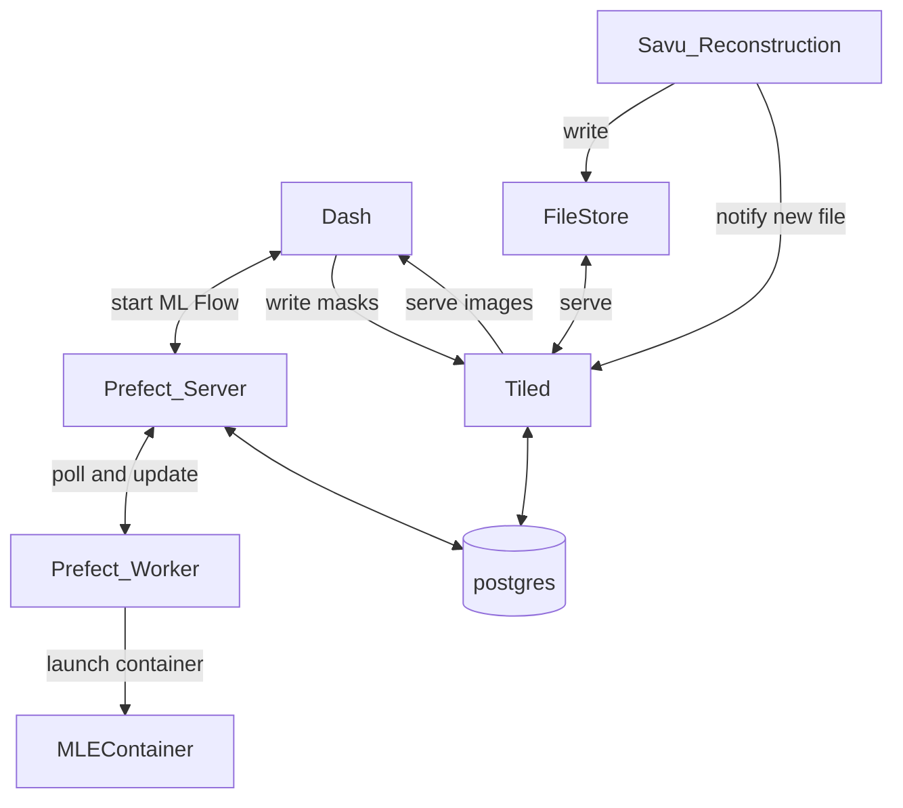

# mlex_tomo_framework
This repo creates a space for documentation and tracking of work needed to create an framework for running the MLExchange Segmentation framework at a beamline. It contains:
- Documentation, both user and configuration
- Sample `docker-compose.yml` file intended for the easy installation of the framework on developer's machines.

This repository is not intended to solve all of the real world deployment issues that one will find at a beamline. In a real beamline, not all of the various services will be on the same machine. However, it is very useful for developers to be able quickly stand up the full platform on a single machine. When the framework is installed at or near beamlines, the `docker-compose.yml` is a good guide towards deploying services on various container orchestration platforms (Hey, have you ever used `Kompose` is build k8s manifests from a docker-compose? It sorta works even!)

# The framework

